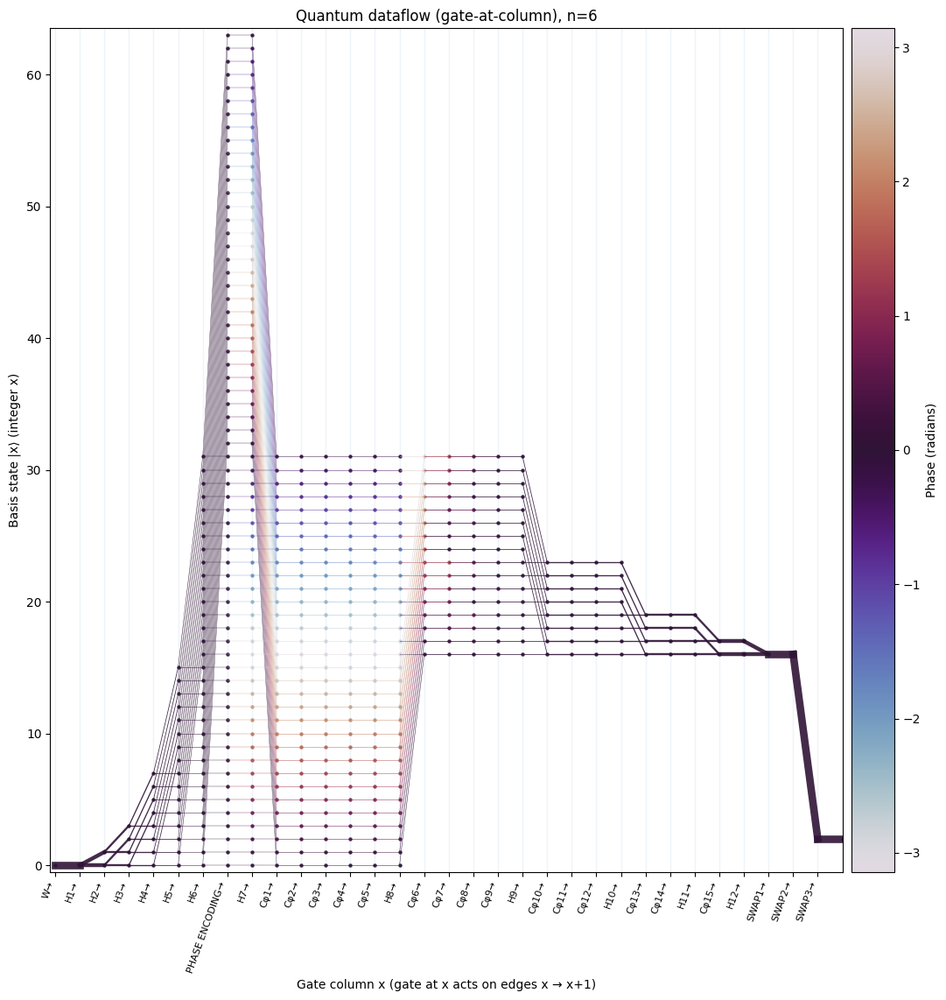

# Quantum Dataflow Diagrams (Qiskit)

This repository provides a Jupyter notebook that reproduces quantum dataflow diagrams-phase-colored, probability-weighted “threads” that visualize quantum parallelism and interference, alongside Qiskit circuit diagrams and statevector validation.

The notebook follows the terminology and symbols used in the reference paper, including:
- `W` / `R` (write/read interface markers),
- labeled gates `H1..`, `Cφ1..`, `SWAP1..`,
- boxed `PHASE ENCODING`,
- a QFT decomposition consistent with the paper’s ordering/sign conventions used in the notebook.

---

## Contents

The notebook (`QuantumDataflowDiagrams.ipynb`) includes implementations and visualizations for:

### 1) QFT — single tone (frequency bin)
- Prepare uniform superposition with `H⊗n`
- Encode a single tone by phase-only diagonal: $\phi[x] = -2\pi f x / 2^n$
- Apply the paper-style QFT circuit and plot:
  - circuit diagram
  - output spectrum $|A[k]|^2$
  - quantum dataflow diagram (with destructive interference clearly visible)

### 2) QFT — square wave (odd harmonics)
- Phase-only square encoding with $\phi[x] \in \{0,\pi\}$ (0° / 180° pattern)
- QFT output shows strong odd harmonics (and mirrored bins)

### 3) Grover / Amplitude Amplification
- Start from $|0...0\rangle$, apply Hadamard ladder
- Oracle phase-flips a target basis state (e.g., state `3`)
- Apply diffusion (amplitude amplification) iteration(s)
- Dataflow highlights how amplitude concentrates on the marked state

### 4) Shor’s algorithm demo — factoring 15 (order finding)
- Demo configuration: **N=15**, **a=2**, **precision_bits=4**
- Uses an explicit controlled modular-multiplication **permutation** (small-N didactic construction)
- Includes:
  - counting register marginal distribution
  - optional precision-register-only dataflow (marginalizing work qubits at every step)

---

## Dataflow diagram conventions (matching the notebook)

The dataflow diagram uses the following consistent conventions:

- **Edge thickness = probability weight**
  - For Hadamard, edge weights are computed using **destination probabilities** $|out|^2$ to avoid “ghost” edges when destructive interference cancels amplitudes.

- **Edge color = phase**
  - Phase is taken from the destination amplitude.
  - Tiny amplitudes are snapped to zero, and phases are only used above a small epsilon.

> Note (precision-only Shor plots): the precision-register probabilities are exact marginals, but “phase of a marginal” is not uniquely defined; the notebook uses a documented phase proxy for coloring only.

---

## Requirements

- Python 3.10+ recommended
- Packages:
  - `qiskit`
  - `numpy`
  - `matplotlib`

## Citation

If you use or adapt this code, please cite the paper that introduced the quantum dataflow diagram concept:

Stefano Markidis, *What is Quantum Parallelism, Anyhow?*

### BibTeX
```bibtex
@inproceedings{markidis2024quantum,
  title={What is quantum parallelism, anyhow?},
  author={Markidis, Stefano},
  booktitle={ISC High Performance 2024 Research Paper Proceedings (39th International Conference)},
  pages={1--12},
  year={2024},
  organization={Prometeus GmbH}
}
